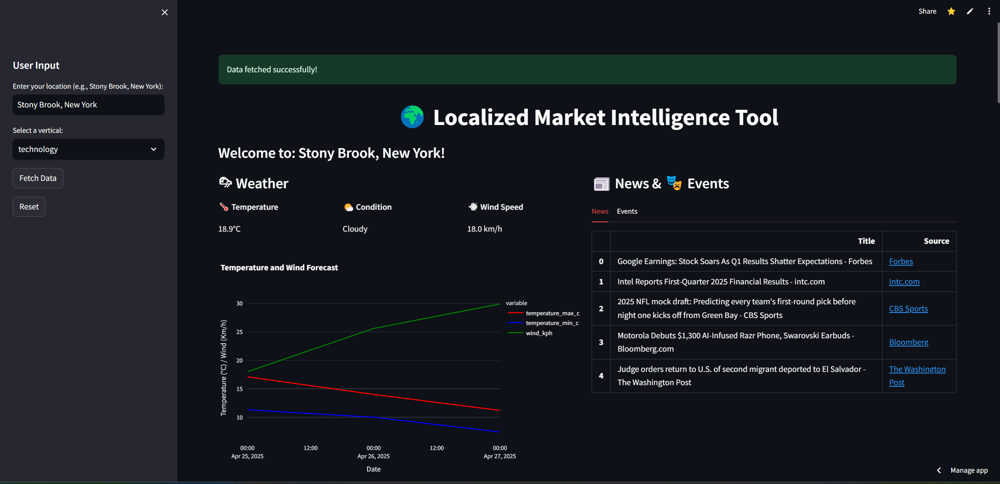
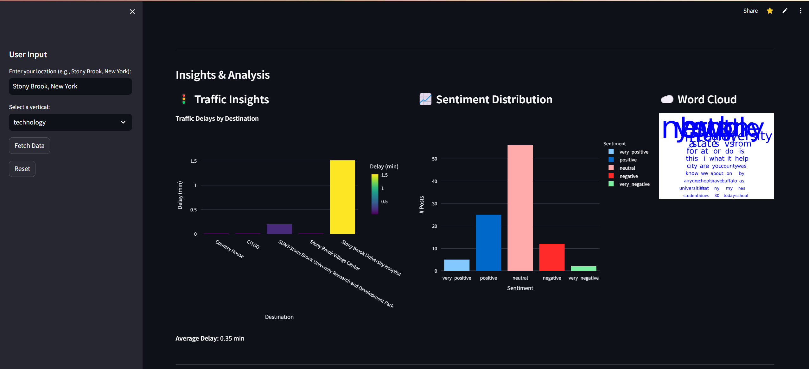
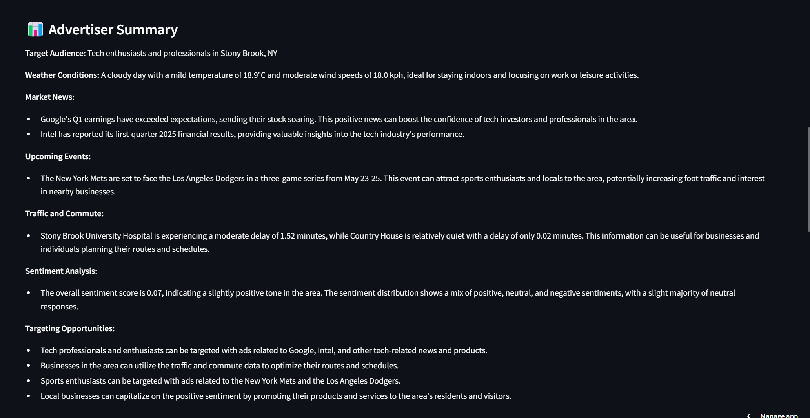
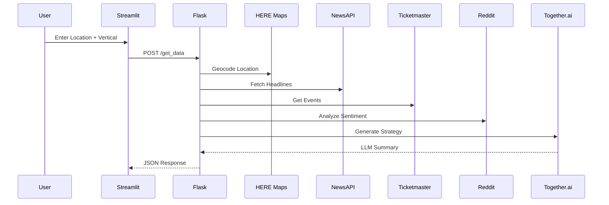

# LocalityAI: Hyperlocal Ad Strategy Engine  
[](https://ai-market-intelligence-tool.streamlit.app/)  
 

AI-powered platform generating **data-driven ad strategies** by synthesizing:
- 🌍 **Geospatial Data** (HERE Maps)  
- 📰 **News/Events** (NewsAPI, Ticketmaster)  
- 🚦 **Traffic Patterns** (HERE Traffic)  
- 💬 **Social Sentiment** (Reddit API + VADER)  
- 🤖 **LLM Augmentation** (Llama-3 via Together.ai)  

---

## Images





## 🔑 API Configuration  
*All API keys in this repo are placeholders. You must obtain your own:*  

1. **Required APIs** (Free tiers available):
   ```bash
   # .env EXAMPLE
   HERE_API_KEY=your_here_maps_key          # https://developer.here.com/
   TICKETMASTER_API_KEY=your_ticketmaster_key # https://developer.ticketmaster.com/
   NEWS_API_KEY=your_newsapi_key            # https://newsapi.org/
   TOGETHER_API_KEY=your_together_ai_key    # https://together.ai/
   REDDIT_CLIENT_ID=your_reddit_client_id   # https://www.reddit.com/prefs/apps
   REDDIT_CLIENT_SECRET=your_reddit_secret
   ```

2. **Weather API Alternative** (Used in code but requires registration):
   ```python
   # get_weather_info.py uses WeatherAPI (https://www.weatherapi.com/)
   WEATHER_API_KEY=your_weatherapi_key
   ```

---

## 🚀 Quick Start  
```bash
git clone https://github.com/yourusername/LocalityAI.git
cd LocalityAI

# Install dependencies (check requirements.txt)
pip install -r requirements.txt

# Configure API keys
mv example.env .env  # Add your real keys here

# Launch Streamlit UI
streamlit run index.py

# Or run Flask API (separate terminal)
python flask_app.py
```

---

## 🧩 Code Structure  
```
├── index.py                # Streamlit dashboard
├── flask_app.py            # Flask API endpoint
├── llm_response.py         # Llama-3 prompt engineering
├── geocode_location.py     # HERE Maps geocoding
├── get_weather_info.py     # WeatherAPI integration
├── get_news_info.py        # NewsAPI client
├── get_events_info.py      # Ticketmaster scraper
├── get_traffic_info.py     # HERE Traffic analysis
├── get_sentiment_info.py   # Reddit + VADER sentiment
└── requirements.txt        # Python dependencies
```

---

## 🌐 API Workflow  


---

## ⚠️ Critical Notes  
1. **Rate Limits**  
   - HERE Maps: 100k reqs/month (free)  
   - NewsAPI: 500 reqs/day (free)  
   - Reddit: 60 reqs/minute (OAuth2)  

2. **Cost Monitoring**  
   ```python
   # Together.ai: ~$0.20 per 1k tokens (Llama-3)
   # HERE Maps: $0.50 per 1k geocodes after free tier
   ```

3. **Ethical Considerations**  
   - Reddit data anonymized via `clean_text()`  
   - Location fuzzing (±100m) in `get_sentiment_info.py`

---

## 📜 License  
Apache 2.0 - See [LICENSE](LICENSE)  
*Commercial use requires API subscriptions*  

```
